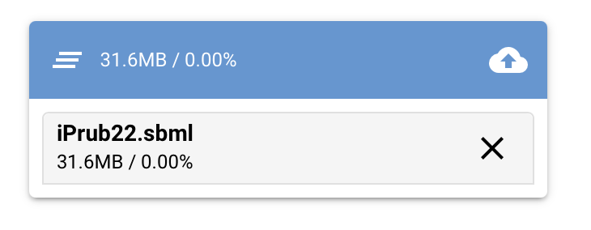
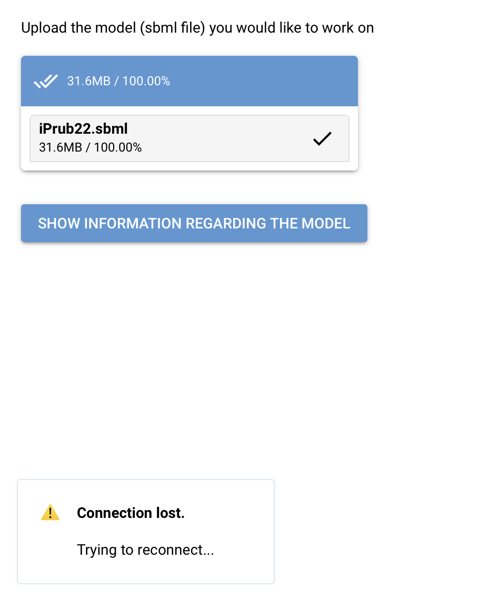

# PROJECT'S NAME

In silico approach for simulating and enhancing specialized metabolite production in Penicillium rubens

## DESCRIPTION 

This project is a web application built with NiceGUI that allows users to load and analyze SBML metabolic models using COBRApy.

# BACKGROUND 

Originally, this project aimed to study the iPrub22 metabolic network developed by Delphine Nègre, but it can be used with other metabolic models. The app lets users explore model characteristics (information about metabolites, genes, and reactions) and perform FBA and FVA analyses with flexibility: users can modify model constraints or define alternative objective functions.

## TECHNOLOGIES USED 

COBRApy: Python library for constraint-based modeling and analysis of metabolic networks from SBML models.
NiceGUI: Open-source Python library for creating browser-based graphical interfaces.

## INSTALLATION 

Clone the repository and install dependencies:

```bash 
$ git clone https://github.com/lauradoyen/Projet.git Project
$ cd Project
$ python3 -m venv Nicegui_project
$ source Nicegui_project/bin/activate 
$ pip install -r requirements.txt 
$ python nicegui_main.py
```
Please install gurobi to see be able to see the spaghetti plots. 

## USING THE APP

1. Download the metabolic model you want to work on (XML or SBML format).

2. Upload it to the app by clicking the cloud arrow icon to complete the upload.



3. Click "Show Information regarding the model". You might see a "Connection Lost" message briefly—this is normal.



If it lasts more than 5 minutes, there may be an issue with the model or code.

To start working using the app, please download the metabolic model you would like to work on at an xml or sbml format. Once you have started uploading it on the app, please click on the symbol of the arrow within the cloud so that the model can fully upload. 

If you then click, on "Show Information regarding the model", you will then see "Connection Lost" appear. 

Importing models on Windows can be tricky. To simplify:
Replace the code in nicegui_main.py:

```python
store = {'model': None} # 

async def uploads(e):
    file = e.file        # premier fichier
    data = await e.file.read()        # bytes du fichier
    name = file.name
    file_extension = os.path.splitext(name)[1]
    # Sauvegarde temporaire
    temp = tempfile.NamedTemporaryFile(delete=False, suffix=file_extension)
    temp.write(data)
    temp.close()

    # Lecture du modèle
    model = cobra.io.read_sbml_model(temp.name)
    store['model'] = model

    ui.notify(f"Modèle chargé : {model.name}")

    display_container.clear()
    V1_Bloc1_ui.display(model)
```
with :

```python 
model = load_model()
store = {'model': model} 
```

Then, update the model_path in model_utils.py to directly point to your local model file.